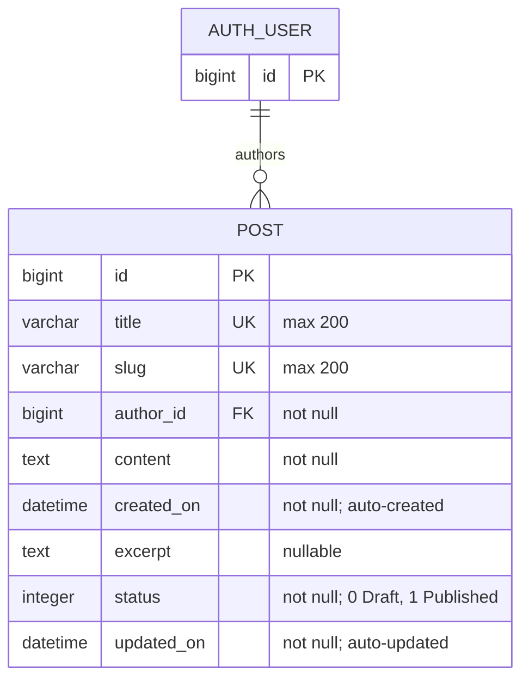

# Entity-relationship diagram

Based on `blog/migrations/0002_post_content_post_created_on_post_excerpt_and_more.py`
(Django migration), including the `Post` entity created by `0001_initial`.

## Relationship details

- One `AUTH_USER` can author zero or many `POST` records.
- Every `POST` belongs to exactly one `AUTH_USER` through `author_id`.
- Deleting an `AUTH_USER` cascades and deletes their `POST` records.
- `POST.title` and `POST.slug` are each unique.
- `POST.content` is required and stores the body of the post.
- `POST.created_on` is set automatically when a post is created.
- `POST.excerpt` is optional; blank values are allowed.
- `POST.status` defaults to `0` (`Draft`) and may be `0` or `1` (`Published`).
- `POST.updated_on` is refreshed automatically whenever a post is saved.
- `AUTH_USER` represents Django's configured `settings.AUTH_USER_MODEL`; its concrete table and fields depend on the project's authentication configuration.
