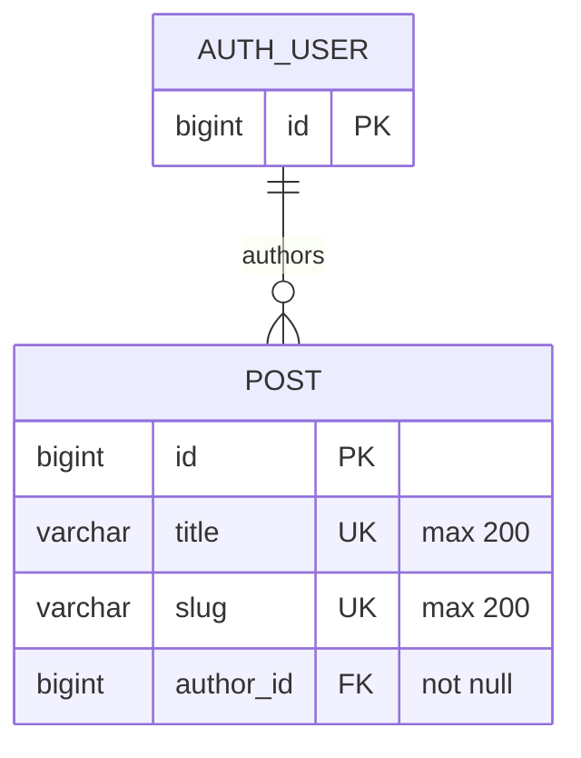

# Form 1: Entity-relationship diagram

Based on `blog/migrations/0001_initial.py` (Django migration).

## Relationship details

- One `AUTH_USER` can author zero or many `POST` records.
- Every `POST` belongs to exactly one `AUTH_USER` through `author_id`.
- Deleting an `AUTH_USER` cascades and deletes their `POST` records.
- `POST.title` and `POST.slug` are each unique.
- `AUTH_USER` represents Django's configured `settings.AUTH_USER_MODEL`; its concrete table and fields depend on the project's authentication configuration.
