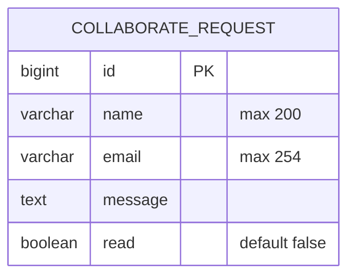

# Form 2: Entity-relationship diagram

Based on `about/migrations/0002_collaboraterequest.py` (Django migration).

## Entity details

- `COLLABORATE_REQUEST.id` is the auto-generated primary key.
- `COLLABORATE_REQUEST.name` stores the requester's name and allows up to 200 characters.
- `COLLABORATE_REQUEST.email` stores the requester's email address and allows up to 254 characters.
- `COLLABORATE_REQUEST.message` stores the collaboration request message.
- `COLLABORATE_REQUEST.read` indicates whether the request has been reviewed and defaults to `false`.
- This migration does not define any foreign-key relationships.
