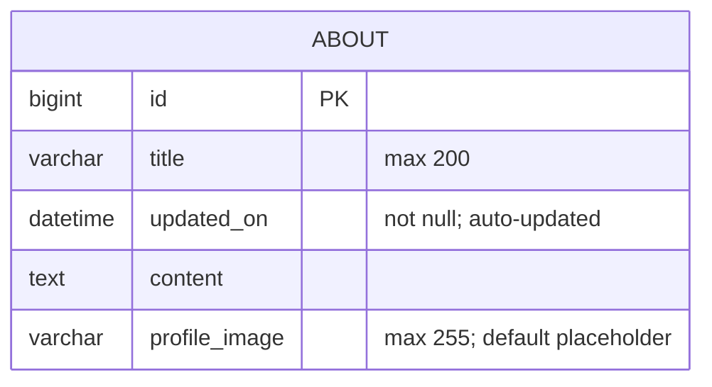

# Form 3: Entity-relationship diagram

Based on `about/migrations/0003_about_profile_image.py` (Django migration),
including the `About` entity created by the preceding migration.

## Entity details

- `ABOUT.id` is the auto-generated primary key.
- `ABOUT.title` stores the About page title and allows up to 200 characters.
- `ABOUT.updated_on` is refreshed automatically whenever an About record is saved.
- `ABOUT.content` stores the About page content.
- `ABOUT.profile_image` stores the Cloudinary image value, allows up to 255 characters,
  and defaults to `placeholder`.
- This migration does not define any foreign-key relationships.
