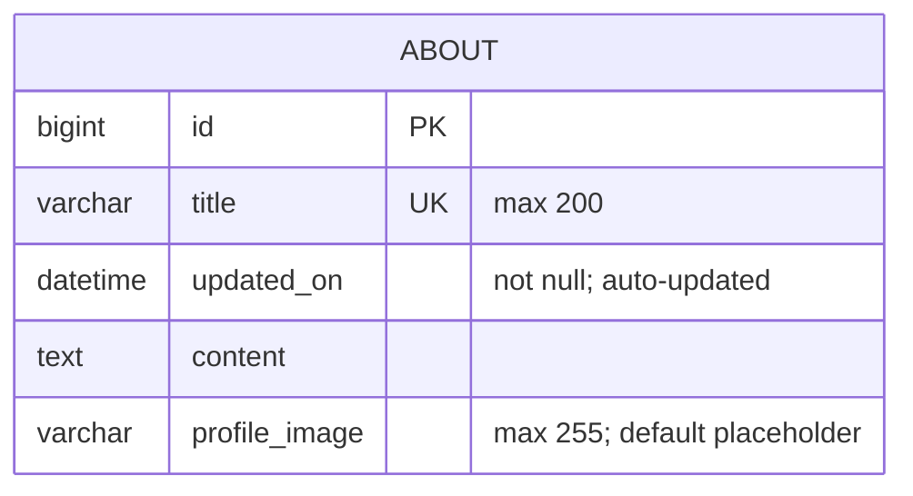

# Form 4: Entity-relationship diagram

Based on `about/migrations/0004_alter_about_title.py` (Django migration),
including the `About` entity state from the preceding migrations.

## Entity details

- `ABOUT.id` is the auto-generated primary key.
- `ABOUT.title` stores the About page title, allows up to 200 characters,
  and is unique.
- `ABOUT.updated_on` is refreshed automatically whenever an About record is saved.
- `ABOUT.content` stores the About page content.
- `ABOUT.profile_image` stores the Cloudinary image value, allows up to 255 characters,
  and defaults to `placeholder`.
- This migration changes `ABOUT.title` to enforce uniqueness.
- This migration does not define any foreign-key relationships.
