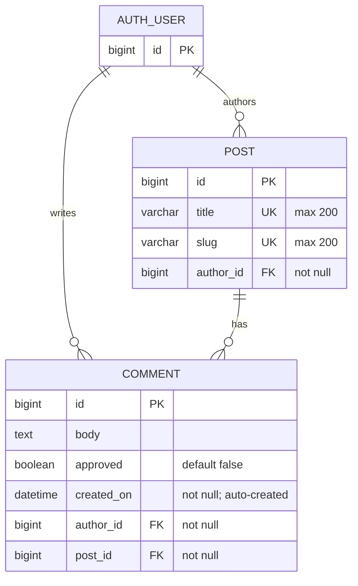

# form_a3: Entity-relationship diagram

Based on `blog/migrations/0003_comment.py` (Django migration), including the
existing `POST` entity and configured `AUTH_USER` entity.

## Relationship details

- One `AUTH_USER` can write zero or many `COMMENT` records.
- Every `COMMENT` belongs to exactly one `AUTH_USER` through `author_id`.
- One `POST` can have zero or many `COMMENT` records.
- Every `COMMENT` belongs to exactly one `POST` through `post_id`.
- Deleting an `AUTH_USER` cascades and deletes their `COMMENT` records.
- Deleting a `POST` cascades and deletes its `COMMENT` records.
- `COMMENT.approved` defaults to `false`.
- `COMMENT.created_on` is set automatically when a comment is created.
- `AUTH_USER` represents Django's configured `settings.AUTH_USER_MODEL`; its concrete table and fields depend on the project's authentication configuration.
