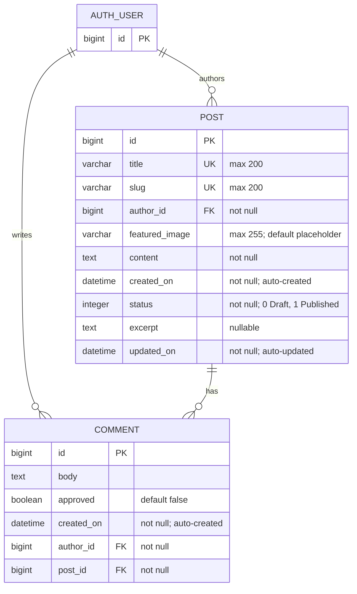

# form_a4: Entity-relationship diagram

Based on `blog/migrations/0004_post_featured_image.py` (Django migration),
including the existing `POST`, `COMMENT`, and configured `AUTH_USER` entities.

## Relationship details

- One `AUTH_USER` can author zero or many `POST` records.
- One `AUTH_USER` can write zero or many `COMMENT` records.
- One `POST` can have zero or many `COMMENT` records.
- Every `POST` belongs to exactly one `AUTH_USER` through `author_id`.
- Every `COMMENT` belongs to exactly one `AUTH_USER` through `author_id`.
- Every `COMMENT` belongs to exactly one `POST` through `post_id`.
- Deleting an `AUTH_USER` cascades and deletes their `POST` and `COMMENT` records.
- Deleting a `POST` cascades and deletes its `COMMENT` records.
- `POST.featured_image` stores the Cloudinary image value, allows up to 255 characters,
  and defaults to `placeholder`.
- `AUTH_USER` represents Django's configured `settings.AUTH_USER_MODEL`; its concrete table and fields depend on the project's authentication configuration.
