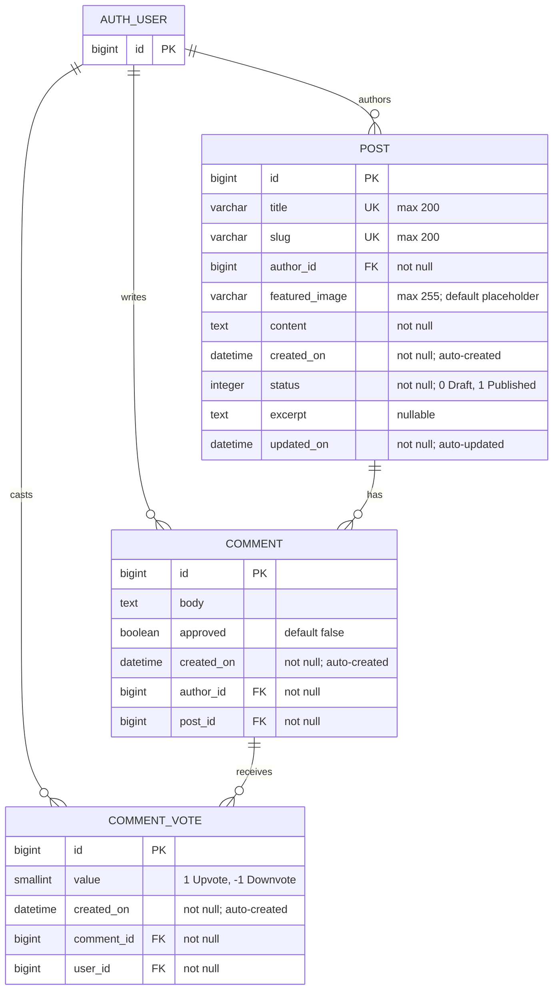

# form_a5: Entity-relationship diagram

Based on `blog/migrations/0005_commentvote.py` (Django migration), including
the existing `POST`, `COMMENT`, and configured `AUTH_USER` entities.

## Relationship details

- One `AUTH_USER` can cast zero or many `COMMENT_VOTE` records.
- One `COMMENT` can receive zero or many `COMMENT_VOTE` records.
- Every `COMMENT_VOTE` belongs to exactly one `AUTH_USER` through `user_id`.
- Every `COMMENT_VOTE` belongs to exactly one `COMMENT` through `comment_id`.
- A user can have at most one vote for a given comment, enforced by the
  `unique_comment_vote` constraint on `(comment_id, user_id)`.
- `COMMENT_VOTE.value` must be `1` (`Upvote`) or `-1` (`Downvote`).
- `COMMENT_VOTE.created_on` is set automatically when a vote is created.
- Deleting an `AUTH_USER` cascades and deletes their votes.
- Deleting a `COMMENT` cascades and deletes its votes.
- `AUTH_USER` represents Django's configured `settings.AUTH_USER_MODEL`; its concrete table and fields depend on the project's authentication configuration.
